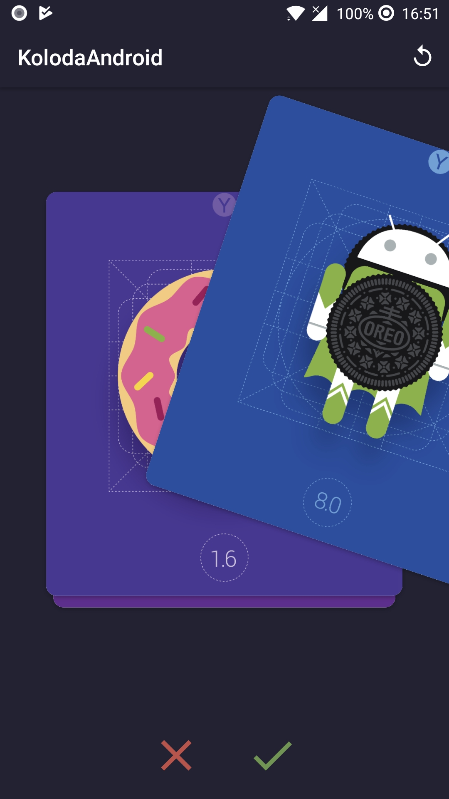
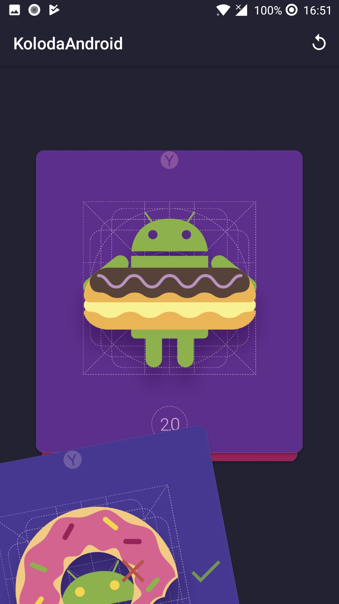
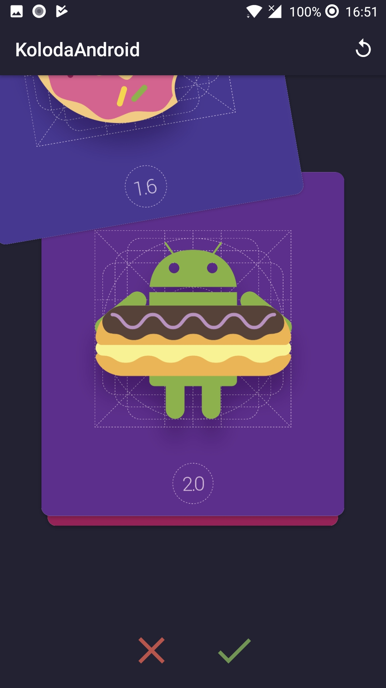

# Koloda-Android





## Requirements
- Android SDK 15+

## Usage

Add to your root build.gradle:
```Groovy
allprojects {
		repositories {
			...
			maven { url 'https://jitpack.io' }
		}
	}
```

Add the dependency:
```Groovy
dependencies {
	        compile 'com.github.Yalantis:Koloda-Android:v0.0.1-alpha'
	}
```

## How to use this library in your project?

First of all, add `Koloda` to the xml layout of your activity, so it looks like that:

```xml
<?xml version="1.0" encoding="utf-8"?>
    <com.yalantis.library.Koloda
  	 android:id="@+id/koloda"
   	 android:layout_width="match_parent"
   	 android:layout_height="match_parent"
   	 app:koloda_card_layout="@layout/item_koloda" />
```

Create your adapter and set it to Koloda adapter
```Kotlin
adapter = YourAdapter(data)
koloda.adapter = adapter
```

## Customization

For customization ui Koloda you can use such attributes value :

To control the card position by scale lower cards set koloda_card_scale_diff attributes float value in layout. The range of ScaleDiff is 0.01 - 0.1. The default value for ScaleDiff is 0.04f
```xml
 <com.yalantis.library.Koloda
        ...	
        app:koloda_card_scale_diff="0.04" 
        .../>
```

To control distance between cards set value to koloda_card_offsetY in dp. The default value for CardOffsetY is 16dp.
```xml
 <com.yalantis.library.Koloda
        ...	
        app:koloda_card_offsetY="16dp" 
        .../>
```
Change angle for card when swipe it you can set value to koloda_card_rotate_angle. The default value for CardRotateAngle is 30
```xml
 <com.yalantis.library.Koloda
        ...	
        app:koloda_card_rotate_angle="30"
        .../>
```

Also you can change visible cards count in desk with koloda_max_visible_cards attributes. The default value for CardsVisible is 3
```xml
 <com.yalantis.library.Koloda
        ...	
        app:koloda_max_visible_cards="3"
        .../>
```

Kolod has reloadPreviousCard() method which reload previous card
```Kotlin
koloda.reloadPreviousCard()
```

Kolod has reloadAdapterData() method which reload all data(Start show data from the beginning)
```Kotlin
koloda.reloadAdapterData() 
```

Also, you can realize automatic swipe using onButtonClicks(isSwipeCardToRight: Boolean) method:
```Kotlin
koloda.onButtonClick(false) - swipe to left
koloda.onButtonClick(true) - swipe to right
```

Also you can create `KolodaListener` and use all the methods of the `KolodaListener`. This interface provides empty implementations of the methods. For any custom animation callback handle you can create any custom listener that cares only about a subset of the methods of this listener can simply implement the interface directly:
<br>onNewTopCard(position: Int)<br />
onCardDrag(position: Int, cardView: View, progress: Float)<br />
onCardSwipedLeft(position: Int)<br />
onCardSwipedRight(position: Int)<br />
onClickRight(position: Int)<br />
onClickLeft(position: Int)<br />
onCardSingleTap(position: Int)<br />
onCardDoubleTap(position: Int)<br />
onCardLongPress(position: Int)<br />
onEmptyDeck()<br />


## Let us know!

We’d be really happy if you sent us links to your projects where you use our component. Just send an email to github@yalantis.com And do let us know if you have any questions or suggestion regarding the animation. 

## License

	The MIT License (MIT)

	Copyright © 2018 Yalantis, https://yalantis.com

	Permission is hereby granted, free of charge, to any person obtaining a copy
	of this software and associated documentation files (the "Software"), to deal
	in the Software without restriction, including without limitation the rights
	to use, copy, modify, merge, publish, distribute, sublicense, and/or sell
	copies of the Software, and to permit persons to whom the Software is
	furnished to do so, subject to the following conditions:

	The above copyright notice and this permission notice shall be included in
	all copies or substantial portions of the Software.

	THE SOFTWARE IS PROVIDED "AS IS", WITHOUT WARRANTY OF ANY KIND, EXPRESS OR
	IMPLIED, INCLUDING BUT NOT LIMITED TO THE WARRANTIES OF MERCHANTABILITY,
	FITNESS FOR A PARTICULAR PURPOSE AND NONINFRINGEMENT. IN NO EVENT SHALL THE
	AUTHORS OR COPYRIGHT HOLDERS BE LIABLE FOR ANY CLAIM, DAMAGES OR OTHER
	LIABILITY, WHETHER IN AN ACTION OF CONTRACT, TORT OR OTHERWISE, ARISING FROM,
	OUT OF OR IN CONNECTION WITH THE SOFTWARE OR THE USE OR OTHER DEALINGS IN
	THE SOFTWARE.
